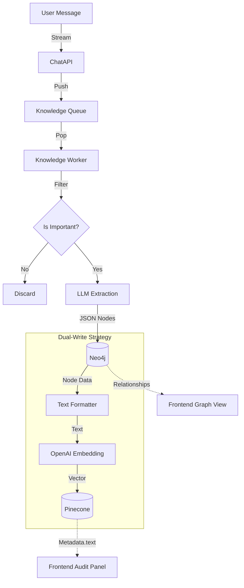

# Knowledge Ingestion Pipeline Analysis (v4.2)

**작성일**: 2026-01-28
**버전**: v4.2 (Audit-Grade Visualization Applied)
**대상**: Backend Knowledge Service

---

## 1. Overview (개요)

본 프로젝트의 지식 처리 파이프라인은 기계적인 텍스트 분할(Fixed-size Chunking) 대신, **LLM 기반의 의미론적 추출(Semantic Extraction)** 방식을 채택하고 있습니다. 사용자의 발화는 **Graph Node(지식의 원자 단위)**로 변환되며, 이 노드가 곧 **임베딩의 단위(Chunk)**가 되어 Graph DB와 Vector DB에 동시에 저장됩니다.

## 2. Detailed Pipeline Flow (상세 흐름)

### Step 1: Ingestion & Filtering (유입 및 필터링)
- **Trigger**: 사용자 메시지 발생 (`stream_message_v32`)
- **Queueing**: 메시지 ID가 비동기 큐(`knowledge_queue`)에 적재됨. (User Latency 영향 없음)
- **Filtering (`_evaluate_importance`)**:
  - `Intent`와 무관하게 지식 가치를 별도 판단.
  - 단순 인사("안녕"), 운영 명령어("에이전트 생성해"), 짧은 리액션("ㅇㅋ") 등은 **Noise**로 분류하여 폐기.
  - 중요 키워드(결정, 확정, 변경, 규칙 등)가 포함된 경우 **HIGH Tier**로 분류하여 처리.

### Step 2: LLM Extraction (청킹 & 구조화)
단순히 문장을 자르는 것이 아니라, LLM에게 "인지적 엔티티(Cognitive Entity)"를 추출하도록 지시합니다.
- **Agent**: `KnowledgeService._llm_extract`
- **System Prompt**: "You are a SUPREME knowledge extraction engine..."
- **Extraction Targets**:
  - `Decision` (의사결정)
  - `Requirement` (요구사항)
  - `Concept` (개념/용어)
  - `Fact` (사실정보)
- **결과물**: JSON 형태의 Node List & Relationship List.
- **의의**: **이 과정 자체가 고지능 청킹(Chunking) 역할을 수행함.**

### Step 3: Graph Storage (Neo4j 저장)
추출된 구조화 데이터를 Graph DB에 저장하여 관계망을 형성합니다.
- **Action**: `_upsert_to_neo4j`
- **Logic**:
  - `Project` 노드와 연결 (`HAS_KNOWLEDGE` 관계 형성).
  - 중복 방지: Content Hash 기반의 ID 생성 (`kg-{hash}`).
  - 속성 저장: `source_message_id`, `created_at`, `is_cognitive` 등 메타데이터 저장.

### Step 4: Embedding & Vector Storage (임베딩 및 벡터 저장)
Graph에 저장된 각 **Node**를 하나의 **Chunk**로 간주하여 임베딩을 수행합니다.

1.  **Text Formatting (`_get_embeddable_text`)**:
    - 노드의 `Type`, `Title`, `Description`, `Content` 등을 하나의 문자열로 결합.
    - 예: `Type: Decision \n Title: DB선정 \n Content: PostgreSQL을 사용하기로 결정함.`
2.  **Embedding Generation**:
    - Model: `openai/text-embedding-3-small`
    - Service: `embedding_service.generate_embedding`
3.  **Vector Upsert (Pinecone)**:
    - **Metadata Enrichment (v4.2 핵심)**:
      - `text`: **임베딩된 원문 텍스트 저장** (최대 4000자 Truncate). -> **Audit Panel 표시용**
      - `source_message_id`: 출처 추적용 ID. -> **Graph/Vector 하이라이트용**
      - `type`, `project_id`: 필터링용.
4.  **Back-linking**:
    - Neo4j의 해당 노드에 `embedding_id`와 `has_embedding=true` 속성을 업데이트하여 Graph와 Vector 간 연결 고리 형성.

---

## 3. Data Schema & Integrity

### 3.1 Node Structure (The Chunk)
지식의 최소 단위입니다.
```json
{
  "id": "kg-a1b2c3d4...",
  "type": "Decision",
  "title": "백엔드 포트 고정",
  "properties": {
    "content": "백엔드 포트는 8002번을 사용한다.",
    "source_message_id": "msg-uuid-...",
    "project_id": "my-project"
  }
}
```

### 3.2 Vector Metadata (Audit Trail)
Admin이 검증할 때 보는 데이터입니다.
```json
{
  "id": "kg-a1b2c3d4...",
  "values": [0.123, -0.456, ...],
  "metadata": {
    "text": "Type: Decision... (원문)",
    "source_message_id": "msg-uuid-...",
    "score": 0.92 (검색 시 생성됨)
  }
}
```

---

## 4. Summary of Flow



## 5. 결론

현재 시스템은 **"메시지 → LLM 구조화(청킹) → Graph/Vector 동시 저장"**의 흐름을 따릅니다.
특히 v4.2 업데이트를 통해 **Vector Metadata에 원문(`text`)과 출처(`source_message_id`)를 강제로 포함**시킴으로써, 프론트엔드에서 별도의 DB 조회 없이도 검색 결과만으로 즉시 근거를 시각화(Highlighting)하고 내용을 검증(Audit)할 수 있는 체계를 완성했습니다.
